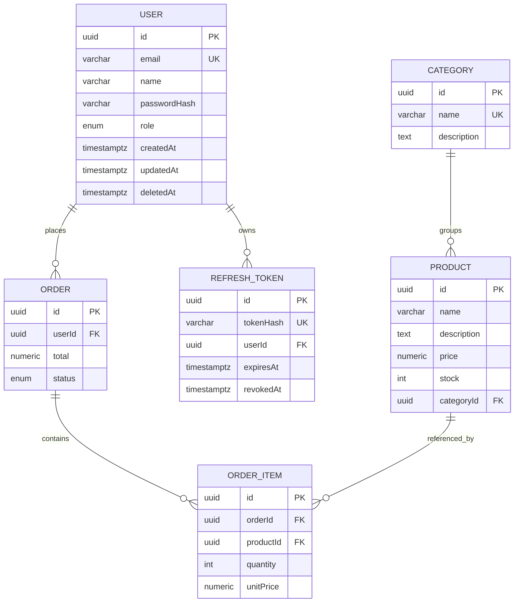

# E-Commerce Backend (Node.js + TypeScript)

A production-style e-commerce backend built to demonstrate **backend architecture
and engineering quality** rather than complex business logic. It is modular,
strictly typed, dependency-injected, fully containerised, and covered by unit
tests.

The domain is intentionally small (users, products, categories, orders) so the
focus stays on the hard parts: **safe inventory handling under concurrency**,
**caching**, **queues**, **transactions**, **auth/RBAC**, and **clean error
handling**.

---

## Table of Contents

- [Features](#features)
- [Tech Stack](#tech-stack)
- [Architecture](#architecture)
- [Project Structure](#project-structure)
- [Database Design (ERD)](#database-design-erd)
- [Getting Started](#getting-started)
- [Environment Variables](#environment-variables)
- [API Documentation](#api-documentation)
- [Authentication & RBAC](#authentication--rbac)
- [Caching Strategy](#caching-strategy)
- [Transactions & Race-Condition Handling](#transactions--race-condition-handling)
- [Queue System](#queue-system)
- [Idempotency](#idempotency)
- [Rate Limiting](#rate-limiting)
- [Error Handling & API Response Standard](#error-handling--api-response-standard)
- [Logging](#logging)
- [Testing](#testing)
- [NPM Scripts](#npm-scripts)

---

## Features

- **Authentication** — register, login, refresh, logout with JWT access tokens +
  rotating refresh tokens (hashed at rest, reuse detection).
- **Authorization (RBAC)** — `ADMIN` / `USER` roles enforced by guards.
- **Products / Categories / Orders / Users** — RESTful CRUD with validation.
- **Inventory & race-condition safety** — stock decremented inside a DB
  transaction using **pessimistic locking** (`SELECT … FOR UPDATE`) to prevent
  overselling.
- **Redis caching** — cache-aside for product listing/detail with TTL and
  pattern-based invalidation.
- **Queues** — BullMQ for order-confirmation emails and analytics events, run by
  a **separate worker process** with retries/backoff.
- **Idempotency** — `Idempotency-Key` header makes order creation safe to retry.
- **Rate limiting** — per-IP sliding window backed by Redis.
- **Validation** — zod schemas for body/params/query with clean field errors.
- **Pagination / filtering / sorting** — for product listing.
- **Structured logging** — Pino with requestId, userId, route, statusCode,
  responseTime.
- **Global error handling** — custom error classes + standard response envelope.
- **OpenAPI/Swagger** — interactive docs at `/docs`.
- **Docker** — one-command `docker compose up`.
- **Unit tests** — Jest with mocked dependencies.

---

## Tech Stack

| Concern        | Choice                          |
| -------------- | ------------------------------- |
| Runtime        | Node.js 20                      |
| Language       | TypeScript (strict, no `any`)   |
| Web framework  | Express                         |
| ORM            | TypeORM                         |
| Database       | PostgreSQL 16                   |
| Cache / queues | Redis 7 + BullMQ                |
| Auth           | JWT (`jsonwebtoken`) + bcryptjs |
| Validation     | zod                             |
| Logging        | Pino / pino-http                |
| Docs           | swagger-jsdoc + swagger-ui      |
| Tests          | Jest + ts-jest                  |
| Tooling        | ESLint (flat) + Prettier        |

---

## Architecture

The codebase follows a **modular, layered architecture** (NestJS-inspired) with
strict separation of concerns and **constructor-based dependency injection**.

```
HTTP Request
    │
    ▼
┌─────────────┐   thin: HTTP only (parse req, shape response)
│ Controller  │
└─────────────┘
    │ calls
    ▼
┌─────────────┐   business logic, transactions, caching, orchestration
│  Service    │
└─────────────┘
    │ calls
    ▼
┌─────────────┐   data access only (TypeORM); no business logic
│ Repository  │
└─────────────┘
    │
    ▼
 PostgreSQL / Redis
```

- **Controllers** only translate between HTTP and services. No business logic.
- **Services** hold all business rules and orchestrate repositories, cache, and
  queues. They depend on **abstractions injected via the constructor**.
- **Repositories** are the only place that touches TypeORM/SQL.
- **Composition root** ([`src/container.ts`](src/container.ts)) wires the whole
  object graph once at startup. This "poor man's DI" keeps dependencies explicit
  and type-checked, and makes every unit swappable (e.g. a fake repo in tests)
  without a heavyweight DI container.

Cross-cutting concerns live in [`src/shared/`](src/shared/): config, logger,
errors, cache, queue, database, middlewares, and utilities.

---

## Project Structure

```
src/
  modules/
    auth/        controllers · services · repositories · dtos · validators · entities · auth.routes.ts
    users/       (admin-only CRUD)
    categories/  (public read, admin write)
    products/    (CRUD + pagination/filter/sort + caching)
    orders/      (transactional, RBAC own/all, idempotent)
  shared/
    config/      typed, validated env (env.ts)
    constants/   roles
    database/    data-source, base entity, transformers, migrations, migrate, seed
    cache/       CacheService (cache-aside helper)
    queue/       connection, queues, publisher, jobs, workers/
    errors/      ApiError hierarchy + global error handler
    http/        standard API response helpers
    logger/      Pino logger + HTTP logger
    middlewares/ auth, roles, validate, rate-limit, not-found
    utils/       idempotency service, pagination
    validators/  shared zod fragments (pagination, id param)
    swagger/     OpenAPI setup
    app.ts       Express app assembly
  container.ts   composition root (dependency injection)
  main.ts        API entrypoint (bootstrap + graceful shutdown)
  worker.ts      queue worker entrypoint (separate process)
tests/           Jest unit tests (auth / product / order services)
```

Each module is self-contained:
`controller → service → repository`, plus its own `dto`, `validator`, `entity`,
and a `*.routes.ts` factory that mounts handlers with their guards/validation.

---

## Database Design (ERD)



Relations: `User 1—* Order`, `User 1—* RefreshToken`, `Category 1—* Product`,
`Order 1—* OrderItem`, `Product 1—* OrderItem`. All domain tables carry
`createdAt` / `updatedAt` / `deletedAt` (**soft delete**) via a shared
`BaseEntity`. Money is stored as `numeric(12,2)` (never float) and converted to a
JS `number` via a column transformer. `OrderItem.unitPrice` snapshots the price
at purchase time so historical orders are immutable.

---

## Getting Started

### Option A — Docker (recommended)

```bash
cp .env.example .env        # optional; compose provides its own values
docker compose up --build
```

This starts **postgres**, **redis**, the **api** (which runs migrations + seeds
demo data, then serves), and the **worker**. The API is then available at
`http://localhost:3000` and docs at `http://localhost:3000/docs`.

### Option B — Local development

Requires a local PostgreSQL and Redis (or run just those via Docker).

```bash
yarn install
cp .env.example .env        # points at localhost by default

# bring up only datastores if you don't have them locally:
docker run -d --name pg   -e POSTGRES_DB=app -e POSTGRES_USER=postgres -e POSTGRES_PASSWORD=postgres -p 5432:5432 postgres:16-alpine
docker run -d --name redis -p 6379:6379 redis:7-alpine

yarn migration:run          # create schema
yarn seed                   # optional demo data
yarn dev                    # start API (tsx watch)
yarn dev:worker             # in another terminal: start the queue worker
```

### Seeded credentials

| Role  | Email               | Password    |
| ----- | ------------------- | ----------- |
| ADMIN | `admin@example.com` | `Admin@123` |
| USER  | `user@example.com`  | `User@1234` |

---

## Environment Variables

All configuration is validated at startup in
[`src/shared/config/env.ts`](src/shared/config/env.ts); the process refuses to
boot on invalid config. See [`.env.example`](.env.example).

| Variable                   | Default                  | Description                          |
| -------------------------- | ------------------------ | ------------------------------------ |
| `NODE_ENV`                 | `development`            | `development` / `test` / `production`|
| `PORT`                     | `3000`                   | HTTP port                            |
| `DATABASE_URL`             | `postgres://…/app`       | PostgreSQL connection string         |
| `REDIS_URL`                | `redis://localhost:6379` | Redis connection string              |
| `JWT_SECRET`               | `change_me`              | Secret for signing JWTs              |
| `JWT_EXPIRES_IN`           | `15m`                    | Access-token lifetime                |
| `REFRESH_TOKEN_EXPIRES_IN` | `7d`                     | Refresh-token lifetime               |
| `RATE_LIMIT_MAX`           | `100`                    | Requests per window per IP           |
| `RATE_LIMIT_WINDOW_SEC`    | `60`                     | Rate-limit window (seconds)          |
| `CACHE_TTL_LIST_SEC`       | `60`                     | Product list cache TTL               |
| `CACHE_TTL_DETAIL_SEC`     | `120`                    | Product detail cache TTL             |
| `IDEMPOTENCY_TTL_SEC`      | `86400`                  | Idempotency key retention            |

> Hostnames come **only** from `DATABASE_URL` / `REDIS_URL`. The same build runs
> locally (`localhost`) and in Docker (service names `postgres` / `redis`) with no
> code changes.

---

## API Documentation

Interactive Swagger UI: **`GET /docs`** · raw spec: **`GET /docs.json`**.

| Method | Endpoint           | Auth        | Description                          |
| ------ | ------------------ | ----------- | ------------------------------------ |
| POST   | `/auth/register`   | –           | Register                             |
| POST   | `/auth/login`      | –           | Login → access + refresh tokens      |
| POST   | `/auth/refresh`    | –           | Rotate refresh token                 |
| POST   | `/auth/logout`     | –           | Revoke refresh token                 |
| GET    | `/products`        | –           | List (page, limit, search, category, sort) |
| GET    | `/products/:id`    | –           | Detail (cached)                      |
| POST   | `/products`        | ADMIN       | Create                               |
| PATCH  | `/products/:id`    | ADMIN       | Update                               |
| DELETE | `/products/:id`    | ADMIN       | Soft delete                          |
| GET    | `/categories`      | –           | List                                 |
| POST   | `/categories`      | ADMIN       | Create                               |
| PATCH  | `/categories/:id`  | ADMIN       | Update                               |
| DELETE | `/categories/:id`  | ADMIN       | Soft delete                          |
| POST   | `/orders`          | USER/ADMIN  | Create order (Idempotency-Key)       |
| GET    | `/orders`          | USER/ADMIN  | List (own for USER, all for ADMIN)   |
| GET    | `/orders/:id`      | USER/ADMIN  | Get one (ownership enforced)         |
| GET    | `/users`           | ADMIN       | List users                           |
| POST   | `/users`           | ADMIN       | Create user                          |
| PATCH  | `/users/:id`       | ADMIN       | Update user                          |
| DELETE | `/users/:id`       | ADMIN       | Soft delete user                     |
| GET    | `/health`          | –           | Liveness probe                       |

Example product listing:
`GET /products?page=1&limit=10&category=<uuid>&search=phone&sort=price_desc`

---

## Authentication & RBAC

- Passwords are hashed with **bcrypt**; the hash column is `select: false` so it
  never leaves the DB by accident.
- **Access tokens** (short-lived JWT) carry `sub` and `role` for stateless authz.
- **Refresh tokens** are random JWTs persisted **only as SHA-256 hashes**, with
  `expiresAt` and `revokedAt`. Each carries a unique `jti` so two tokens are never
  identical.
- **Rotation**: every `/auth/refresh` revokes the presented token and issues a new
  pair.
- **Reuse detection**: presenting a valid-but-already-rotated token revokes the
  user's entire token family (defends against stolen-token replay).
- **Guards**: `authGuard` verifies the bearer token and populates `req.user`;
  `roleGuard(Role.ADMIN)` enforces RBAC. Order ownership is enforced in the
  controller (USER sees only their own; ADMIN sees all).

---

## Caching Strategy

Cache-aside (lazy loading) for product reads, implemented in
[`ProductService`](src/modules/products/services/product.service.ts) on top of
[`CacheService`](src/shared/cache/cache.service.ts):

1. **Read** from Redis.
2. **Miss** → query PostgreSQL.
3. **Populate** Redis with a TTL, then return.

**Invalidation on writes**: create/update/delete clears the specific
`products:detail:<id>` key and **all** `products:list:*` keys. List keys are
removed by pattern using a non-blocking `SCAN` iterator (never `KEYS`, which
blocks Redis). TTLs act as a safety net for anything missed.

---

## Transactions & Race-Condition Handling

Order creation is the critical path. See
[`OrderService.create`](src/modules/orders/services/order.service.ts).

The whole operation runs in a **single DB transaction**, and for each product we
take a **pessimistic write lock**:

```ts
// productRepository.lockById — SELECT ... FOR UPDATE
manager
  .getRepository(Product)
  .createQueryBuilder('product')
  .setLock('pessimistic_write')
  .where('product.id = :id', { id })
  .getOne();
```

Why this prevents overselling when two users race for the last unit:

1. Stock decrements and the order/items insert are **atomic** — all commit or all
   roll back.
2. The first transaction to reach a product row **holds the lock**; any concurrent
   transaction wanting that row **blocks** until the first commits, then reads the
   already-decremented stock and correctly fails the stock check.
3. Rows are locked in a **deterministic order** (sorted by id) so two orders over
   the same products can never **deadlock**.

This is verified by a concurrency test: firing 8 simultaneous orders for a
single-stock product yields **exactly one success and seven `409`s**, with stock
ending at `0` (never negative).

---

## Queue System

[BullMQ](https://docs.bullmq.io/) over Redis, with a **separate worker process**
([`src/worker.ts`](src/worker.ts)) so slow background work never blocks the API
and the two tiers scale independently.

- **Queues**: `email` (order confirmation) and `analytics` (events).
- **Producer**: [`QueuePublisher`](src/shared/queue/queue.publisher.js) is injected
  into services for type-safe enqueueing.
- **Reliability**: 3 attempts with exponential backoff; completed jobs trimmed,
  failed jobs retained for inspection/replay.
- Order side-effects are enqueued **after** the transaction commits, and a queue
  failure is logged rather than failing an already-placed order.

---

## Idempotency

Order creation accepts an optional `Idempotency-Key` header. The
[`IdempotencyService`](src/shared/utils/idempotency.service.ts) (Redis-backed):

- Atomically **reserves** the key (`SET NX`) and runs the operation.
- **Replays** the stored result for a retry after completion.
- **Rejects** a concurrent in-flight retry with `409`.
- **Releases** the reservation if the operation fails, so a genuine retry works.

Result: retried/duplicated submissions never create a second order or
double-decrement stock.

---

## Rate Limiting

Per-IP **sliding-window** limiter
([`rate-limit.middleware.ts`](src/shared/middlewares/rate-limit.middleware.ts))
using a Redis sorted set (atomic `MULTI`): old timestamps are trimmed, the current
request recorded, and the count compared to the limit. Over-limit requests get
`429` with `Retry-After`; every response carries `X-RateLimit-Limit` /
`X-RateLimit-Remaining`. Configurable via `RATE_LIMIT_MAX` / `RATE_LIMIT_WINDOW_SEC`.

---

## Error Handling & API Response Standard

A single global error handler
([`error-handler.ts`](src/shared/errors/error-handler.ts)) converts all thrown
errors into one envelope and maps known types (custom `ApiError`, zod, JWT,
TypeORM `QueryFailedError`) to the right status. Internal details/stack traces are
**never** exposed in production.

**Success**

```json
{ "success": true, "data": { } }
```

Paginated responses add `"meta": { "page", "limit", "total", "totalPages" }`.

**Error**

```json
{ "success": false, "message": "Product not found", "code": "PRODUCT_NOT_FOUND" }
```

Validation errors add a `details` array of `{ field, message }`.

---

## Logging

Structured logging with **Pino** + **pino-http**. Every request gets a
`requestId` (honouring an inbound `X-Request-Id`), and each completed-request log
line includes `requestId`, `userId`, `route`, `statusCode`, and `responseTime`.
Secrets (passwords, tokens, auth headers) are redacted. Pretty output in dev, raw
JSON in production.

---

## Testing

```bash
yarn test
```

Unit tests (Jest, mocked dependencies) cover the business logic that matters:

- **AuthService** — registration/duplicate handling, password hashing, login,
  refresh rotation + reuse detection, logout, unique-token regression.
- **ProductService** — cache hit/miss, cache invalidation, not-found paths.
- **OrderService** — stock decrement & total calculation, **oversell prevention**,
  duplicate-line merging, idempotency wrapping, resilience to queue failures.

Repositories, cache, queues, and the DataSource are mocked, so tests need no
database or Redis and run in well under a second.

---

## NPM Scripts

| Script                  | Description                                  |
| ----------------------- | -------------------------------------------- |
| `yarn dev`              | Run API in watch mode (tsx)                  |
| `yarn dev:worker`       | Run the queue worker in watch mode           |
| `yarn build`            | Compile TypeScript → `dist/`                 |
| `yarn start`            | Run compiled API (`dist/main.js`)            |
| `yarn start:worker`     | Run compiled worker                          |
| `yarn typecheck`        | `tsc --noEmit`                               |
| `yarn lint` / `:fix`    | ESLint                                       |
| `yarn format` / `:check`| Prettier                                     |
| `yarn test` / `:watch`  | Jest                                         |
| `yarn migration:run`    | Run migrations (dev, tsx)                     |
| `yarn seed`             | Seed demo data (dev, tsx)                     |
```
